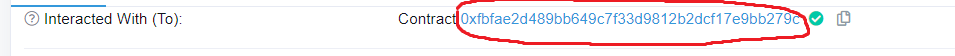

# Sniping bot

## Features
- Buy a token at it first liquidity add
- Buy the dip of a token (Next feature)
- Selling base on a stoploss amount (Next feature)
- Sell a token when the price exceed an certain amount based on a multiplicator

## Pre-requisired : 
- install NodeJS : https://nodejs.org/dist/v14.17.1/node-v14.17.1-x64.msi
- `TO USE THE BOT YOU HAVE TO WRAP THE AMOUNT OF BNB YOU WANT TO USE FOR THE TRANSACTION (EXCLUDING TRANSACTION FEES)`

## How to use : 

1 - Open .env with a text editor to adjust the bot as you like.

### BASIC OPTIONS
- WBNB_CONTRACT - You don't need to change it, this is the offical WBNB contract
- FACTORY - You don't need to change it, this is the official Pancake Swap V2 Factory
- ROUTER - You don't need to change it, this is the official Pancake Swap V2 Router
- YOUR_ADDRESS - This is your wallet address, it will be used to redirect transaction results to your wallet
- YOUR_MNEMONIC - Your seed phrase, we need it to create a temporary wallet  **IF YOU THINK THAT THIS BOT IS A SCAM, JUST CREATE A NEW METAMASK WALLET WITH A NEW SEED PHRASE**

### COMMON OPTIONS
- COMMON_GWEI - This is the gas price, set it to 20 for sniping (its better)
- COMMON_GAS_LIMIT - Gas limit amount, will output a big transaction fee price but it will be regulated depending on how much the transaction uses (I personnaly use a limit of 400000)
- COMMON_AUTO_APPROVE - The bot will approve automatically the swap of the token SET `COMMON_AUTO_APPROVE=1` TO ENABLE IT AND `COMMON_AUTO_APPROVE=0` TO DISABLE IT

### SNIPE BOT OPTIONS
- SNIPE_BOT_MIN_LIQUIDITY_ADDED - Minimum amount in BNB to wait before buying
- SNIPE_BOT_AMOUNT_OF_WBNB - The amount you want to spend in WBNB
- SNIPE_BOT_TO_PURCHASE - The token adress of the token you want to snipe
- SNIPE_BOT_TAKE_PROFIT - Profit multiplicator (Example : You bought for 1BNB of a token and you want to sell for 2 BNB then you should set `SNIPE_BOT_TAKE_PROFIT=2`)
- SNIPE_BOT_SELL_AFTER_BUY - The bot will sell after the buy transaction when the token value will be greater or equals to the wanted value SET `SNIPE_BOT_SELL_AFTER_BUY=1` TO ENABLE IT AND `SNIPE_BOT_SELL_AFTER_BUY=0` TO DISABLE IT
- SNIPE_BOT_SELL_ONLY - The bot will only sell when profit is corresponding to what you entered in the parameters, `SNIPE_BOT_SELL_ONLY=1` to enable, and `SNIPE_BOT_SELL_ONLY=0` to disable
- SNIPE_BOT_SELL_BALANCE_PURCENT - The bot will sell an amount of your balance based on the value you entered, possible values are 25/50/100

### HARVEST BOT OPTIONS (SHOULD WORK BUT CONSIDER ITS STILL IN BETA)
- HARVEST_TOKEN_ADDRESS - BUSD TOKEN ADDRESS, can be replaced by any token
- HARVEST_TOKEN_ADDRESS_B - The other token adress of the pair, in example : Lavacake, FrozenCake...
- HARVEST_POOL_ID - To find the pool id, look at your deposit in the pool transaction, click on "click to see more", then "decode input data" : 
- HARVEST_MASTERCHEF_ADDRESS - To find the masterchef address, look at your deposit in the pool transaction and click on the contract as shown in the image : 
- HARVEST_SELL_BALANCE_PURCENT - Purcent of the balance to sell after withdraw, possible values are 25/50/100
- HARVEST_SELL_UNLOCK_TIMESTAMP_UTC - Timestamp when the harvest will be unlocked, use this tool to get the timestamp : http://www.timestamp.fr/?
- HARVEST_AUTO_APPROVE - Auto approve LP pair, token pair, and WBNB pair if not already approved, `HARVEST_AUTO_APPROVE=1` to enable, and `HARVEST_AUTO_APPROVE=0` to disable
- HARVEST_AUTO_SELL - Auto sell after withdrawing `HARVEST_AUTO_SELL=1` to enable, and `HARVEST_AUTO_SELL=0` to disable

2 - To ensure the bot is working you have to approve `WBNB`

3 - If this is your first time launching the tool, start `install.bat` , it will run a `npm install` commands to download the prerequire libraries

4 - Before you start the bot, please ensure to have swapped the desired amount of `BNB` you want to use for the buy bot into `WBNB`

5 - Just open `start.bat` and wait.

## BONUS

If you mind launching multiple bot, just copy the whole folder into another one and change the `PORT` value on this line

`const PORT = 5050;`

## MAIN MODE

WBNB Contract main-net :

`const WBNB_CONTRACT = 0xbb4cdb9cbd36b01bd1cbaebf2de08d9173bc095c;`

Pancake swap router main-net : 

`const ROUTER = 0x10ED43C718714eb63d5aA57B78B54704E256024E;`

Pancake swap factory main-net : 

`const FACTORY = 0xcA143Ce32Fe78f1f7019d7d551a6402fC5350c73;`

## TEST MODE

WBNB Contract test-net :

`const WBNB_CONTRACT = 0xae13d989dac2f0debff460ac112a837c89baa7cd;`

Pancake swap router test-net : 

`const ROUTER = 0x9Ac64Cc6e4415144C455BD8E4837Fea55603e5c3;`

Pancake swap factory test-net : 

`const FACTORY = 0xb7926c0430afb07aa7defde6da862ae0bde767bc;`

## Donation address
If you are satisfied and wants to keep alive the project feel free to send BNB to this address : `0xF4ef5611c04629BaC6aFD82d9630B6C1B06d4BB2`
