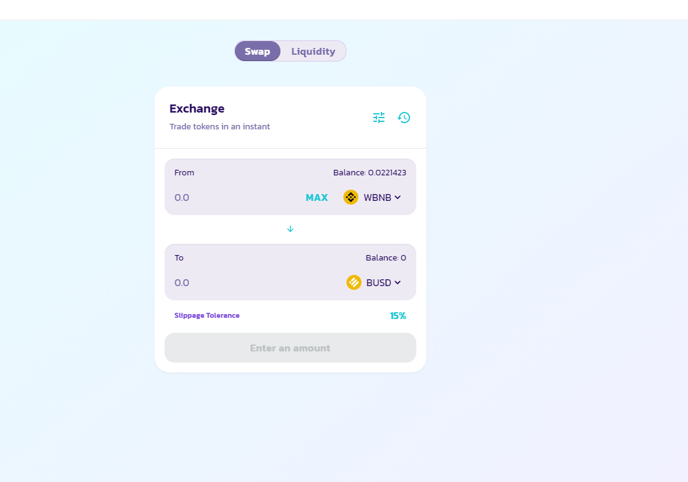

# Sniping bot

## Features
- Buy a token at it first liquidity add
- Sell a token when the price exceed an certain amount (WIP)
- Sell a token after a X seconds (WIP)

## Pre-requisired : 
- install NodeJS : https://nodejs.org/dist/v14.17.1/node-v14.17.1-x64.msi

## How to use : 

1 - Open .env with a text editor to adjust the bot as you like.

The options are : 
- WBNB_CONTRACT - You don't need to change it, this is the offical WBNB contract
- FACTORY - You don't need to change it, this is the official Pancake Swap V2 Factory
- ROUTER - You don't need to change it, this is the official Pancake Swap V2 Router
- YOUR_ADDRESS - This is your wallet address, it will be used to redirect transaction results to your wallet
- SLIPPAGE - As in poocoin this will adjust the amount of token you have to receive for the transaction to be working, 0 equals to no slippage so transaction shouldnt fail
- GWEI - This is the gas price, set it to 20 for sniping (its better)
- GAS_LIMIT - Gas limit amount, will output a big transaction fee price but it will be regulated depending on how much the transaction uses
- MIN_LIQUIDITY_ADDED - Minimum amount in BNB to wait before buying
- YOUR_MNEMONIC - Your seed phrase, we need it to create a temporary wallet  ** IF YOU THINK THAT THIS BOT IS A SCAM, JUST CREATE A NEW METAMASK WALLET WITH A NEW SEED PHRASE**
- AMOUNT_OF_WBNB - The amount you want to spend in WBNB
- TO_PURCHASE - The token adress of the token you want to snipe
- ENABLE_SELL - If enabled it will automaticall sell the bought token after a timer of X seconds (NOT IMPLEMENTED YET)
- SELL_TIMER - Amount in seconds before launching sell order ( NOT IMPLEMENTED YET )

2 - To ensure the bot is working you have to approve `WBNB`

3 - If this is your first time launching the tool, start "install.bat" , it will run a "npm install" commands to download the prerequire libraries

4 - Before you start the bot, please ensure to have swapped the desired amount of `BNB` you want to use for the buy bot into `WBNB`

5 - Just click start and wait.

## BONUS

If you mind launching multiple bot, just copy the whole folder into another one and change the `PORT` value on this line

`const PORT = 5050;`

## Donation address
If you are satisfied and wants to keep alive the project feel free to send BNB to this address : `0xF4ef5611c04629BaC6aFD82d9630B6C1B06d4BB2`
